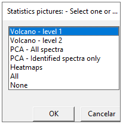

# Introduction

The PipMet is a package with functions wrappers for xcms and CAMERA GC-MS data processing workflow with additional packages in order to generate automatic images for data and algorithm evaluation, as well as the evaluation of final results. It can work entirely based on pop-ups windows after initiating the main function `workData()` if the information is not previously provided by arguments.
It also provides a quantification method which rely on a representative ion (most intense ion) for each spectrum proposed and it is confirmed by the presence os the second most intense ion. In the case of derivatization, the software can remove ions introduced by the derivatization reactions from the quantification process, such as m/z 73 for the trimethylsilyl groups.

<div class="figure" style="text-align: center">

<p class="caption">(\#fig:unnamed-chunk-1)PipMet workflow.</p>
</div>


This vignette describes the usage of the global function `workData()` from the PipMet R package in order to process GC-MS acquired data. 
The `workData()` is a wrapper for files readings, preprocessing raw data into viable spectra and a quantification table and normalization. The user may provide the information required through parameters to the `workData()` function or through pop-up windows. 

Therefore, the only function the user needs to call is as follows:


```r
result <- workData()
```


# Data processing example


The PipMet R package accompanies eight GC-MS analysis file of sugarcane gems and its commercial variety energycane. The samples were collected and analysed as described by Abreu and colleagues^1^. The files contain data from 630s to 690s.
Bellow we load the package and initialize the processing data function.


```r
library(PipMet)
result <- workData()
```


One of the first steps is to locate files, determine files extension and read a metadata table. The examples files are located in the 'inst/ext' folder in the PipMet installation folder. To avoid searching through the installation files, we can set `example = TRUE` in the main function. That can be done such as:


```r
library(PipMet)
result <- workData(example = TRUE)
```


This way, the sample directory, metadata path and extension will not be asked to the user.


## Files reading


<div class="figure" style="text-align: center">

<p class="caption">(\#fig:unnamed-chunk-5)File reading and conversion.</p>
</div>


Before the processing starts, the user must point what kind of parallelization he must apply to the process (Figure 2.2). For more information, read on the the BiocParallel package.


<div class="figure" style="text-align: center">

<p class="caption">(\#fig:unnamed-chunk-6)Parallelization mode.</p>
</div>


Furthermore, the user may inform m/z and rt (retentions time) for specific ions to be monitored throuhout the entire processing. For example, internal standards can be monitored through the 'Monitor EIC' option.


As a first step, the user will be asked to point the folder where the files to be processed are located (Figure 2.3). Once we set `example = TRUE`, this pop-up will be supressed.


<div class="figure" style="text-align: center">

<p class="caption">(\#fig:unnamed-chunk-7)Samples folder.</p>
</div>


Following that, the user is asked to provide a name for the processing project, which will be used as the name of the folder where the processing will occur and create the output files (Figure 2.4). For the example, the project will be named 'Example'.


<div class="figure" style="text-align: center">

<p class="caption">(\#fig:unnamed-chunk-8)Project folder name.</p>
</div>


The files extension will be asked, then, if the `example` is not set as TRUE (Figure 2.5). The PipMet package is capable of reading '.mzML' and '.mzXML' files through the *xcms*, *MSnbase* and *mzR* packages. Files with different extensions may be converted using the *Mass++* ^3^ or *Proteowizard Softwares*^4^, for example. The files provided for the examples are .mzXML files.


<div class="figure" style="text-align: center">

<p class="caption">(\#fig:unnamed-chunk-9)File extensions accepted.</p>
</div>


The metadata file must be provided in order to proper process the analysis files (Table 2.1). It is a sheet .csv file containing a 'sample' column for the samples names and the 'file' column with the file path to each of the samples. Each row represent a sample. More columns can and should be added in order to enhance grouping-demanding steps. In the set of examples, we have two replicates of samples collected from Energycane and two from Sugarcane, two Pool and two Blank samples. The metadata.csv file will be as follow:


Table: (\#tab:unnamed-chunk-10)Metadata table.

|sample      |group  |file              |
|:-----------|:------|:-----------------|
|20009cg02_1 |Blank  |20009cg02_1.mzXML |
|20009cg03_1 |Pool   |20009cg03_1.mzXML |
|20009cg08_1 |Energy |20009cg08_1.mzXML |
|20009cg09_1 |Energy |20009cg09_1.mzXML |
|20010cg02_1 |Blank  |20010cg02_1.mzXML |
|20010cg03_1 |Pool   |20010cg03_1.mzXML |
|20009cg17_1 |Sugar  |20009cg17_1.mzXML |
|20009cg22_1 |Sugar  |20009cg22_1.mzXML |

The PipMet asks if the user already have a metadata.csv file prepared, if the `example` is not set as TRUE (Figure 2.6). If 'Yes', the user will be asked to point the path to the metadata file. Though, if 'No', a metadata.csv file will be created with basic names for files with the extension given in the sample_dir so the user can fill it.


<div class="figure" style="text-align: center">

<p class="caption">(\#fig:unnamed-chunk-11)Metadata table.</p>
</div>


Here, the user may create different categories to describe the samples with column names (Figure 2.7). It is important to make sure there is no other filled columns or rows except those containing the samples. For that, select the empty columns and rows and delete its content before saving. If there is the content, the software will alert the user to delete and reupload the metadata file.


<div class="figure" style="text-align: center">

<p class="caption">(\#fig:unnamed-chunk-12)Metadata information.</p>
</div>

When the files are properly read, a 'Visualization_results' folder will be created in your project folder the software saves generated pictures for the user to evaluate the quality of the initial data, such as total ion count and base peak chromatograms and heatmaps (Figure 2.8).


<div class="figure" style="text-align: center">

<p class="caption">(\#fig:unnamed-chunk-13)Chromatograms and cluster of samples.</p>
</div>

## Preprocessing


<div class="figure" style="text-align: center">

<p class="caption">(\#fig:unnamed-chunk-14)Processing.</p>
</div>


The first step in the preprocessing phase is the selection of peaks among noise, done with the MatchedFilter algorythm from xcms. Therefore, the true peaks will be picked as the one that can pass gaussian filters. There is also de possibility of applying a filter to select only peaks above a certain intensity threshold (Figure 2.10).In the present example, we will be using a 150 intensity threshold for final spectra quality improvement.


<div class="figure" style="text-align: center">

<p class="caption">(\#fig:unnamed-chunk-15)Intensity filter.</p>
</div>


Afterwards, a retention time correction and features grouping algorythms will be applied and the user may also be asked to provide one category from the metadata to lead the grouping step if there is more than one. As a final step to the pre-processing step regarding to select viable peaks, the raw data is used to fill peaks that seems to be missing.

As the previous step, the processing step generates multiple images so that the user can evaluate the performance of the algorithms implemented, such as chromatograms comparing the pre- and post-processing steps, a boxplot of the samples intensities and a distribution of peaks detected along the retention time for each of the samples (Figure 2.11 and 2.12).


<div class="figure" style="text-align: center">

<p class="caption">(\#fig:unnamed-chunk-16)Chromatograms postprocessing.</p>
</div>


<div class="figure" style="text-align: center">

<p class="caption">(\#fig:unnamed-chunk-17)Boxplot of intensities postprocessing and instensity of detected peak in postprocessed data.</p>
</div>


## Identification

<div class="figure" style="text-align: center">

<p class="caption">(\#fig:unnamed-chunk-18)Identification</p>
</div>


### Spectra definition

The peaks selected are furthered grouped into spectra using retention time information and correlation information among the peaks. The user will be asked the data acquisition mode (positive and negative), column setup (polar and non-polar), temperatura program (isothermal, ramp, custom). For the example, select the following: 'positive', 'non-polar' and 'ramp'.


### Annotation


When the spectra are finalized, the PipMet software will create a .msp file and a pre_anno.csv file. The first is to be uploaded in the NIST MS Search Software ^2^ for the spectra search in the available databases. Also, it is possible to generate a .pdf file with EIC of the 6 most intense ions of each of spectrum (Figure 2.14).


<div class="figure" style="text-align: center">

<p class="caption">(\#fig:unnamed-chunk-19)Extracted ion chromatogram.</p>
</div>


The user must identify each of the spectrum and write the name of the compound identified in the pre_anno.csv sheet, using the id of the spectrum, present in the .msp file and the table in pre_anno. Non-indentified spectra may remaining unnanotated. When finished, the user must save the pre_anno.csv file and click 'Ok' in the pop-up (Figure 2.15).


<div class="figure" style="text-align: center">

<p class="caption">(\#fig:unnamed-chunk-20)Spectra annotation.</p>
</div>


For the 30 spectra generated, the pre_anno.csv with the annotation information is as follow:


Table: (\#tab:unnamed-chunk-21)Table 2. Annotation file.

|  id|mz |       rt|annotation       |
|---:|:--|--------:|:----------------|
|   1|NA | 669.1000|                 |
|   2|NA | 667.1472|                 |
|   3|NA | 687.3255|Palmitic acid    |
|   4|NA | 645.7250|Inositol         |
|   5|NA | 662.4250|                 |
|   6|NA | 650.3799|Tyrosine         |
|   7|NA | 632.7000|Allantoin        |
|   8|NA | 660.1515|FAME C16         |
|   9|NA | 637.4276|                 |
|  10|NA | 661.4000|                 |
|  12|NA | 646.9499|                 |
|  13|NA | 633.7106|                 |
|  14|NA | 638.5364|                 |
|  15|NA | 640.3500|                 |
|  16|NA | 664.7471|                 |
|  18|NA | 688.5554|                 |
|  19|NA | 637.6735|                 |
|  21|NA | 654.7856|                 |
|  23|NA | 675.7625|                 |
|  24|NA | 669.8623|                 |
|  25|NA | 683.1997|                 |
|  27|NA | 653.3966|                 |
|  28|NA | 656.5103|                 |
|  29|NA | 652.1000|                 |
|  33|NA | 676.7077|p-Coummaric acid |
|  38|NA | 680.5215|                 |
|  82|NA | 639.2010|                 |
| 115|NA | 683.1962|                 |
| 138|NA | 679.7216|                 |


The annotation may vary due to different available libraries in the NIST MS Search software.
For improving the identification, the retention index can also be used, if a RI.csv file is provided, containing a 'rt' and 'RI' column (Figure 2.16). Once the example files are of a slim range of retention time, we will not add any retention index.


<div class="figure" style="text-align: center">

<p class="caption">(\#fig:unnamed-chunk-22)Retention index.</p>
</div>


At the end of this substep, some pictures are plotted, such as hierarchycal clustering and a heatmaps based on the similarity of the samples (Figure 2.17 and 2.18). For more information, check the CluMSID R package ^5^.


<div class="figure" style="text-align: center">

<p class="caption">(\#fig:unnamed-chunk-23)Hierarchycal plot.</p>
</div>


<div class="figure" style="text-align: center">

<p class="caption">(\#fig:unnamed-chunk-24)Heatmap.</p>
</div>


## Quantification


<div class="figure" style="text-align: center">

<p class="caption">(\#fig:unnamed-chunk-25)Quantification.</p>
</div>


Once the spectra were grouped and identified, the quantification step will proceed by extracting the intensity of the most intense ion (called representative ion) of each spectrum to represent the intensity of the entire spectrum. However, GC-MS analysis often require some sort of sample preparation that may alter the the representative ion of the analyte. For example, sample derivatized with trimethylsilyl groups present the m/z 73 fragment-ion as the most intense in almost every spectrum, even though they represent the trimethylsilyl groups in the analyte. For that occurrence, the PipMet asks the user if the samples were derivatized (Trimethylsilation is currently supported) in order to avoid the m/z 73 as the representative peak, what would include too much variation in the the data (Figure 2.20). Therefore, if the m/z 73 is the most intense, the second peak will be used as representative.


<div class="figure" style="text-align: center">

<p class="caption">(\#fig:unnamed-chunk-26)Derivatization.</p>
</div>


Another feature for improve the quantification step is to merge or remove compounds. In derivatization cases, the same compound may be identified more than once, for the different numbers of trimethylsilyl groups in the analyte, called derivates. For proper quantification, the intensity of all derivatives that originated from the same molecule must be summed in order to represent the real intensity of the analyte. 
The user may also remove a compound identified previously from the quantification, such as contaminantes or column bleeding.


### Data normalization


The PipMet package, through the NormalyzerDE package, offers different methods of normalization so that the user can choose the best to addapt to the data after evaluation the models and the printed report. For the normalization to occur, the user must point the category from which the samples are better grouped (Figure 2.21). For the example, select 'group'.


<div class="figure" style="text-align: center">

<p class="caption">(\#fig:unnamed-chunk-27)Groups for normalization.</p>
</div>


The normalyzerDE R package provides different normalization methods and a report with metrics for the user to pick the best normalization that fit his data (Figure 2.22). In the Example, a folder 'Normalyzer_results' is created and the user is invited to look at the pdf report and to choose among the methodologies. Here, we picked the CycLoess normalization. Then a histogram of the variance and standard deviation is plot in the 'Statistics' folder, along with a boxplot of the same metrics and its outliers. 


<div class="figure" style="text-align: center">

<p class="caption">(\#fig:unnamed-chunk-28)Boxplot and histogram of variance and standard deviation.</p>
</div>


The variance and standard deviation is calculated from the intensities of the representative ion and the second most intense in each of the spectra. If the spectra is not correctly proposed (for example, if it has a coelution not detected), the rate between the representative peak and the second most intense will not be stable along the samples where the compound appears, showing too much variance and standard deviation. The same may happen to bleeders or contaminants. Therefore, the user must monitor those results in order to have variance and standard deviation (sd) as low as possible. If some compound present high variance or sd, the user may choose to remove outliers in general (shown in the boxplot image) ou remove compounds with variance bigger than a threshold (Figure 2.23). For the example, the CycLoess normalization is enough and it won't be necessary to remove outliers ou any compound.


<div class="figure" style="text-align: center">

<p class="caption">(\#fig:unnamed-chunk-29)Normalization check.</p>
</div>


Further on, the user is asked which column from the metadata table represents the replicate column, if there is any (Figure 2.24). For the example files, that information is also represented by the 'group' column.


<div class="figure" style="text-align: center">

<p class="caption">(\#fig:unnamed-chunk-30)Replicate information.</p>
</div>


### Statistics Figures


After the quantification step is completed, the user can choose to plot one or more statistics pictures, such as volcano plots, heatmaps and PCA (Figure 2.25). For the volcano plots, the user may choose to plot a single comparison Volcano plot (Sugar X Energy, for example). If more than one category to describe the samples are available, the user may do a Level 2 volcano plot, to compare using to describers. Such as 'group' and 'Treatment', resulting in 'Energy: Control X Treatment' and 'Sugar: Control X Treatment' volcano plots. 

<div class="figure" style="text-align: center">

<p class="caption">(\#fig:unnamed-chunk-31)Statistics pictures.</p>
</div>

As for our example only contains one describer (group: Blank, Pool, Sugar and Energy) we will only plot a volcano plot level 1 of comparison. The user is then instructed to select a condition from the metadata table to compare two characteristics from that condition. Here, we choose 'group' to compare the 'Energy' and 'Sugar' compounds (Figure 2.26).


<div class="figure" style="text-align: center">

<p class="caption">(\#fig:unnamed-chunk-32)Volcano setup.</p>
</div>


Along with each of the comparison for plotting the Volcano plot (Figure 2.27), a file containing the p-value (significance) and fold change of the comparisons is written inside the volcano plot folder. 


<div class="figure" style="text-align: center">

<p class="caption">(\#fig:unnamed-chunk-33)Volcano plot.</p>
</div>


Next, the the user may choose to plot PCA of all spectra proposed, even to non-identified ones with 'PCA - All spectra' option. The user is then asked to choose a particular condition to plot the PCA for specified samples only. For example, we choose to only look at Sugarcane and Energycane samples, therefore, we choose 'group' and select both 'Sugar' and 'Energy' describers (Figure 2.28).


<div class="figure" style="text-align: center">

<p class="caption">(\#fig:unnamed-chunk-34)PCA of all samples and selected samples.</p>
</div>


The PCA is plotted again only for the identified compounds, repeating the same process as before: plot of all samples and asking for specific samples (Figure 2.29).


<div class="figure" style="text-align: center">

<p class="caption">(\#fig:unnamed-chunk-35)PCA of all samples and selected samples - Identified compounds only.</p>
</div>


The heatmaps are plotted colored by the different categories describing the samples and to plot them, the user is asked how the samples should be named if the pictures (Figure 2.30 and 2.31).


<div class="figure" style="text-align: center">

<p class="caption">(\#fig:unnamed-chunk-36)Heatmaps of all spectra generated and heatmap of only identified spectra.</p>
</div>


<div class="figure" style="text-align: center">

<p class="caption">(\#fig:unnamed-chunk-37)Heatmap of identified spectra with samples as the mean of their replicates.</p>
</div>


The aforementioned pictures are all generated and saved inside the project folder, along with the normalization results, such as the quantification table normalized and not-normalized, including the variance and standard deviation for the first one. The time and memory consumption may vary due to the size of the processing data, image format file chosen along with the decision to generate them, the parallelization mode and numbers of cores used, among other things.

The pop-ups only appear if the user do not specify the information required in the parameters of the main function. If everything is given prior to the beginning of the processing, the function will work without any intervention or pop-up. For the parameters, refer to the `PipMet` documentation.


<div class="figure" style="text-align: center">

<p class="caption">(\#fig:unnamed-chunk-38)Processing done.</p>
</div>


## In-house database


Once the processing is done, the identified compounds can be used to create a in-house database to be uploaded in NIST MS Search Software (Figure 2.33). In this case, the user is asked whether to create it or not, as following:


<div class="figure" style="text-align: center">

<p class="caption">(\#fig:unnamed-chunk-39)In-house database creation.</p>
</div>


For this extra step, the user may provide more information than the name, retention time and index and spectrum (Figure 2.34). A dataInfo.csv will be created in the folder, if the user agree to add more information, where information about molecule describers such as CAS, InChiKey, PubChem ID, ChemSpider ID, retention index and more can be included. If the user doesn't want to add more information, the `info` parameter in `workData` should be set to `FALSE`.


<div class="figure" style="text-align: center">

<p class="caption">(\#fig:unnamed-chunk-40)Add more information to the compounds.</p>
</div>


After filling most of the information as possible, there can still be missing information, as in the case of these example:


Table: (\#tab:unnamed-chunk-41)DataInfo table.

|Name             |formula  | exact.mass|       rt|CAS         |ChemSpider |InChIKey                    | PubChem.ID|Class |RI |
|:----------------|:--------|----------:|--------:|:-----------|:----------|:---------------------------|----------:|:-----|:--|
|Palmitic acid    |C16H32O2 |   256.2402| 687.3255|408-35-5    |NA         |IPCSVZSSVZVIGE-UHFFFAOYSA-N |        985|NA    |NA |
|Inositol         |C6H12O6  |   180.0634| 645.7250|173524-45-3 |NA         |CDAISMWEOUEBRE-UHFFFAOYSA-N |        892|NA    |NA |
|Tyrosine         |C9H11NO3 |   181.0739| 650.3799|55520-40-6  |NA         |OUYCCCASQSFEME-QMMMGPOBSA-N |       6057|NA    |NA |
|Allantoin        |C4H6N4O3 |   158.0440| 632.7000|5377-33-3   |NA         |POJWUDADGALRAB-UHFFFAOYSA-N |        204|NA    |NA |
|FAME C16         |C17H34O2 |   270.5000| 660.1515|            |NA         |FLIACVVOZYBSBS-UHFFFAOYSA-N |         NA|NA    |NA |
|p-Coummaric acid |C9H8O3   |   164.1600| 676.7077|            |NA         |NGSWKAQJJWESNS-ZZXKWVIFSA-N |         NA|NA    |NA |


After filling the forms and pressing 'Ok', the software will still try to recover the missing information and more. It will be asked if the user would like to add retention index information, if there missing indexes (Figure 2.35). For that, the user must provide the kind of retention index (supported one are 'linear', 'lee' and 'kovats') and from what information to look for. It is recommended that the user provide a InChiKey or CAS number for each compound for they are much more reliable and non-ambiguous to look for in the NIST system in order to recover de retention index information.If more than one retention index is present, the the software returns the RI as a mean of the registered RIs.


<div class="figure" style="text-align: center">

<p class="caption">(\#fig:unnamed-chunk-42)Retention index information.</p>
</div>


Here we use InChiKey information and the user is asked to check the DatabaseInfo.csv file and fill missing fields, if possible. 
The resulting information file is as such:


Table: (\#tab:unnamed-chunk-43)Table 4. DatabaseInfo.csv table.

|Name             |formula  | exact.mass|       rt|CAS         |ChemSpider |InChIKey                    | PubChem.ID|Class |       RI|
|:----------------|:--------|----------:|--------:|:-----------|:----------|:---------------------------|----------:|:-----|--------:|
|Palmitic acid    |C16H32O2 |   256.2402| 687.3255|408-35-5    |NA         |IPCSVZSSVZVIGE-UHFFFAOYSA-N |        985|NA    | 1964.833|
|Inositol         |C6H12O6  |   180.0634| 645.7250|173524-45-3 |NA         |CDAISMWEOUEBRE-UHFFFAOYSA-N |        892|NA    |       NA|
|Tyrosine         |C9H11NO3 |   181.0739| 650.3799|55520-40-6  |NA         |OUYCCCASQSFEME-QMMMGPOBSA-N |       6057|NA    |       NA|
|Allantoin        |C4H6N4O3 |   158.0440| 632.7000|5377-33-3   |NA         |POJWUDADGALRAB-UHFFFAOYSA-N |        204|NA    |       NA|
|FAME C16         |C17H34O2 |   270.5000| 660.1515|NA          |NA         |FLIACVVOZYBSBS-UHFFFAOYSA-N |         NA|NA    | 1917.444|
|p-Coummaric acid |C9H8O3   |   164.1600| 676.7077|NA          |NA         |NGSWKAQJJWESNS-ZZXKWVIFSA-N |         NA|NA    |       NA|

And the creation of the in-house database is concluded (Figure 2.36).


<div class="figure" style="text-align: center">

<p class="caption">(\#fig:unnamed-chunk-44)In-house database created.</p>
</div>


## Session Information


```r
sessionInfo()
```

```
## R version 4.2.1 (2022-06-23 ucrt)
## Platform: x86_64-w64-mingw32/x64 (64-bit)
## Running under: Windows 10 x64 (build 19044)
## 
## Matrix products: default
## 
## locale:
## [1] LC_COLLATE=Portuguese_Brazil.utf8  LC_CTYPE=Portuguese_Brazil.utf8   
## [3] LC_MONETARY=Portuguese_Brazil.utf8 LC_NUMERIC=C                      
## [5] LC_TIME=Portuguese_Brazil.utf8    
## 
## attached base packages:
## [1] stats     graphics  grDevices utils     datasets  methods   base     
## 
## loaded via a namespace (and not attached):
##  [1] bookdown_0.29   digest_0.6.29   R6_2.5.1        jsonlite_1.8.0 
##  [5] magrittr_2.0.3  evaluate_0.16   highr_0.9       stringi_1.7.8  
##  [9] cachem_1.0.6    rlang_1.0.5     cli_3.4.0       rstudioapi_0.14
## [13] jquerylib_0.1.4 bslib_0.4.0     rmarkdown_2.16  tools_4.2.1    
## [17] stringr_1.4.1   xfun_0.33       yaml_2.3.5      fastmap_1.1.0  
## [21] compiler_4.2.1  htmltools_0.5.3 knitr_1.40      sass_0.4.2
```

---

# References


1. Abreu LGF, Silva N, Ferrari A, Carvalho L, Fiamenghi M, Carazolle M, Fill T, Pilau E, Pereira G, Grassi M: **Metabolite profiles of energy cane and sugarcane reveal different strategies during the axillary bud outgrowth**. *Plant Physiology and Biochemistry*, 2021, ***167***:504-516. 

2. NIST. **NIST Standard Reference Database 1A**. Available in: https://chemdata.nist.gov/mass-spc/ms-search/docs/Ver20Man_11.pdf. 

3. TANAKA S,  FUJITA Y, PARRY HE, YOSHIZAWA AC, MORIMOTO K, MURASE M, YAMADA Y, UTSUNOMIYA S, KAJIHARA K, FUKUDA M, IKAWA M, TABATA T, KATAHASHI K, AOSHIMA K, NIHEI Y, NISHIOKA T, ODA Y, TANAKA K: **Mass++: a visualization and analysis tool for mass spectrometry**. *Journal Of Proteome Research*, 2014, ***13***:3846-3853.

4. KESSNER D, CHAMBERS M, BURKE R, AGUS D, MALLICK P: **ProteoWizard: open source software for rapid proteomics tools development**. *Bioinformatics*, 2008, ***24(21)***:2534-2536.

5. DEPKE T, FRANKE R, BRÖNSTRUP M: **CluMSID: an R package for similarity-based clustering of tandem mass spectra to aid feature annotation in metabolomics**. *Bioinformatics*, 2019, ***35(17)***: 3196-3198.
