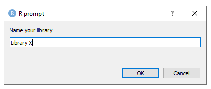
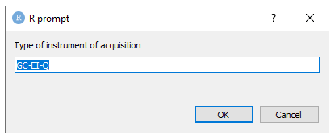
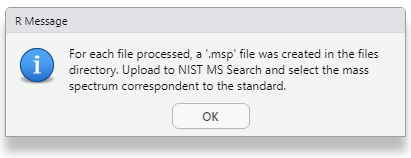
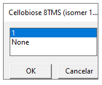
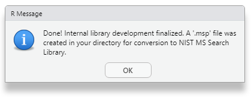

# Introduction

The PipMet is a package with functions wrappers for xcms and CAMERA GC-MS data processing workflow with additional packages in order to generate automatic images for data and algorithm evaluation, as well as the evaluation of final results. It can work entirely based on pop-ups windows after initiating the main function `workData()` if the information is not previously provided by arguments.
It also provides a quantification method which rely on a representative ion (most intense ion) for each spectrum proposed and it is confirmed by the presence os the second most intense ion. In the case of derivatization, the software can remove ions introduced by the derivatization reactions from the quantification process, such as m/z 73 for the trimethylsilyl groups.

This vignette describes the usage of the function `workLib()` from the PipMet R package in order to create a internal library of compounds in `.msp` format to upload in the NIST MS Search software.
The `workLib()` is a wrapper for files readings, preprocessing raw data and writing into viable spectra to be validated manually. the resulting file is a `.msp` file with spectra and information provided by the user through parameters to the `workLib()` function or through pop-up windows. 

Therefore, the only function the user needs to call is as follows:

```{r, echo =TRUE, results = 'hide', eval = FALSE}
workLib()
```


# Data processing example


The PipMet R package accompanies X GC-MS analysis files of compounds for the internal library creation.
Bellow we load the package and initialize the processing data function.

```{r, echo =TRUE, results = 'hide', eval = FALSE}
library(PipMet)
result <- workLib()
```

One of the first steps is to locate files, determine files extension and read a metadata table. The examples files are located in the 'inst/ext' folder in the PipMet installation folder. To avoid searching through the installation files, we can set `example = TRUE` in the main function. That can be done such as:

```{r, echo =TRUE, results = 'hide', eval = FALSE}
library(PipMet)
result <- workLib(example = TRUE)
```

This way, the sample directory, metadata path and extension will not be asked to the user.


## Files reading


Before the processing starts, the user must point what kind of parallelization should be applied to the process (Figure 1). For more information, read on the BiocParallel package. 

```{r, out.width='25%', fig.align='center', fig.cap='Figure 1. PipMet parallelization options.', echo=FALSE}
knitr::include_graphics('01.png')
```

As a first step, the user will be asked to name the library to be created (Figure 2).

```{r, out.width='40%', fig.align='center', fig.cap='Figure 2.Library name.', echo=FALSE}

```

Then the user will be asked to point the folder where the files to be processed are located. Once we set `example = TRUE`, this pop-up will be supressed (Figure 3).

```{r, out.width='40%', fig.align='center', fig.cap='Figure 3. Choose the samples folder.', echo=FALSE}
knitr::include_graphics('1.png')
``` 

Following that, the user is asked to provide a name for the processing project, which will be used as the name of the folder where the library will be processed occur and the output files created (Figure 4). For the example, the project will be named 'Example'.

```{r, out.width='40%', fig.align='center', fig.cap='Figure 4. Project folder name.', echo=FALSE}
knitr::include_graphics('2.png')
``` 

The files extension will be asked, then, if the `example` is not set as TRUE (Figure 5). The PipMet package is capable of reading '.mzML' and '.mzXML' files through the *xcms*, *MSnbase* and *mzR* packages. Files with different extensions may be converted using the *Mass++* ^3^ or *Proteowizard Softwares*^4^, for example. The files provided for the internal library creation example are .mzML files.

```{r, out.width='25%', fig.align='center', fig.cap='Figure 5. File extensions accepted.', echo=FALSE}
knitr::include_graphics('3.png')
``` 

The metadata file must be provided in order to proper process the analysis files (Table 1). It is a sheet .csv file containing a 'compound' column for the analyte names, 'rt' for the retention time in seconds, 'formula', 'exact.mass', 'file' with the file path to each of the samples and some describers such as 'CAS', 'InChiKey', 'ChemSpider ID' and 'PubChem ID'. Each row represent a compound. In the set of examples, we have 6 compounds, with its multiple derivative molecular forms. The metadata.csv file will be as follow:


```{r, echo=FALSE, results='asis', caption='Table 1. Library metadata table.'}
knitr::kable(read.csv(system.file("extdata", "lib_metadata.csv", package = "PipMet")),caption='Table 1. Library metadata table.')
```

The PipMet asks if the user already have a metadata.csv file prepared, if the `example` is not set as TRUE (Figure 6). If 'Yes', the user will be asked to point the path to the metadata file. Though, if 'No', a lib_metadata.csv file will be created with basic names for files with the extension given in the sample_dir so the user can fill it.

```{r, out.width='35%', fig.align='center', fig.cap='Figure 6. Metadata table.', echo=FALSE}
knitr::include_graphics('4.png')
``` 

The next step is to provide information about the ion mode of data acquisition. Accepted are 'positive' and 'negative'. For the example files, the data was acquired in the positive mode.


## Preprocessing


The first step in the preprocessing phase is the selection of peaks among noise, done with the MatchedFilter algorithm from xcms. Therefore, the true peaks will be picked as the one that can pass gaussian filters. The chromatogram is only searched for peaks in a retention time windows of 5+/- of the RT given by the user in the library metadata table.

As the files are processed individually, there is no need for grouping and pairing the samples in order to go on with the processing. 

## Identification


### Spectra definition

The peaks selected are furthered grouped into spectra using retention time information and correlation information among the peaks (Figure 7). The user will be asked the retention index desired (kovats, linear, akane and lee), column setup (polar and non-polar), temperatura program (isothermal, ramp, custom). For the example, select the following: 'kovats', 'non-polar' and 'ramp'. Then, the equipment of data acquisition information will be asked. For the following example, the data was acquired in a GC-EI-Q equipment.

```{r, out.width='35%', fig.align='center', fig.cap='Figure 7. Equipment information.', echo=FALSE}

``` 

Furtheron, the package will try to retrieve any available data about retention index information from the NIST online database using the CAS number.

### Manual Validation


When the spectra are finalized, it will be written in a  .msp file for each of the compound, to be uploaded in the NIST MS Search Software ^2^ the spectra manually validation with spectral databases (Figure 8).

```{r, out.width='35%', fig.align='center', fig.cap='Figure 8. Equipment information.', echo=FALSE}

``` 

In this step, the user must upload the .msp file for the compound shown in the pop-up and select the id of the spectrum that correspond to that compound, sequentially (Figure 9). If there is a problem, the user may restart the validation step by choosing to 'Repeat' at the end.

```{r, out.width='20%', fig.align='center', fig.cap='Figure 9. Cellobiose (isomer 1) identification.', echo=FALSE}

``` 

After the validation, a final .msp spectra is written, named after the name choosen in the beggining with the relevant information provided by the user in the library metadata table (Figure 10). To upload the .msp file as a library to NIST MS Search, the user may use the conversion tool LIB2NIST ^1^.

```{r, out.width='35%', fig.align='center', fig.cap='Figure 10. Internal library construction done.', echo=FALSE}

``` 

## Session Information

```{r}
sessionInfo()
```


---

# References

1. NIST. **Library Conversion Tool**. Available in: https://chemdata.nist.gov/mass-spc/ms-search/Library_conversion_tool.html.

2. NIST. **NIST Standard Reference Database 1A**. Available in: https://chemdata.nist.gov/mass-spc/ms-search/docs/Ver20Man_11.pdf. 

3. TANAKA S,  FUJITA Y, PARRY HE, YOSHIZAWA AC, MORIMOTO K, MURASE M, YAMADA Y, UTSUNOMIYA S, KAJIHARA K, FUKUDA M, IKAWA M, TABATA T, KATAHASHI K, AOSHIMA K, NIHEI Y, NISHIOKA T, ODA Y, TANAKA K: **Mass++: a visualization and analysis tool for mass spectrometry**. *Journal Of Proteome Research*, 2014, ***13***:3846-3853.

4. KESSNER D, CHAMBERS M, BURKE R, AGUS D, MALLICK P: **ProteoWizard: open source software for rapid proteomics tools development**. *Bioinformatics*, 2008, ***24(21)***:2534-6.
